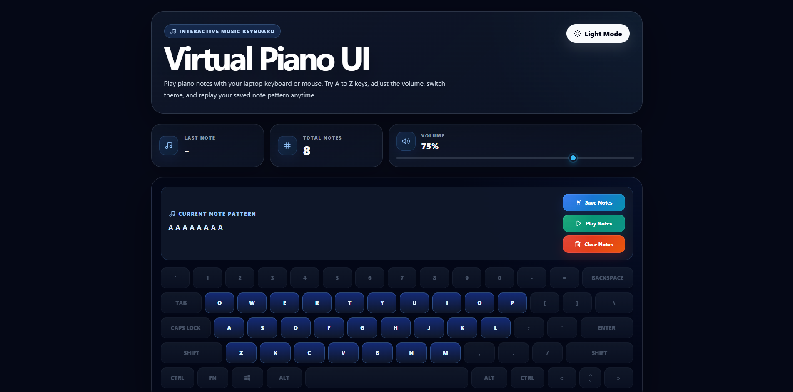

# Virtual Piano UI

A modern interactive virtual piano built with React and SCSS.

Play notes using your keyboard or mouse, create note patterns, replay saved patterns, pause/resume playback, mute audio, and save patterns locally.



## Features

- A-Z interactive piano keyboard
- Mouse and physical keyboard support
- Volume control
- Dark and light theme
- Theme saved in localStorage
- Current note pattern display
- Play, clear, and save notes
- Text-to-notes input
- Saved note patterns
- LocalStorage persistence
- Duplicate pattern prevention
- Play, pause, resume, restart, mute, and delete saved patterns
- Confirmation modals
- Toast notifications
- Responsive design
- Micro-interactions and active key animations

## Tech Stack

- React
- Create React App
- SCSS Modules
- React Icons
- React Toastify
- HTML5 Audio
- LocalStorage

## Run Locally

```bash
npm install
npm start
```

## Build

```bash
npm run build
```

## Preview

Add the project preview image here.

## Author

**Ashish Ranjan**

- Portfolio: https://www.ashishranjan.net
- GitHub: https://github.com/a2rp
- CodePen: https://codepen.io/ash1198
- LinkedIn: https://www.linkedin.com/in/aashishranjan
- Facebook: https://www.facebook.com/theash.ashish/
- YouTube: https://www.youtube.com/@ashishranjan-ashz?sub_confirmation=1
- Email: mailto:ash.ranjan09@gmail.com

## Support

- Support: https://a2rp-donation-page.netlify.app/
- Buy Me A Coffee: https://buymeacoffee.com/a2rp
- Patreon: https://patreon.com/a2rp
