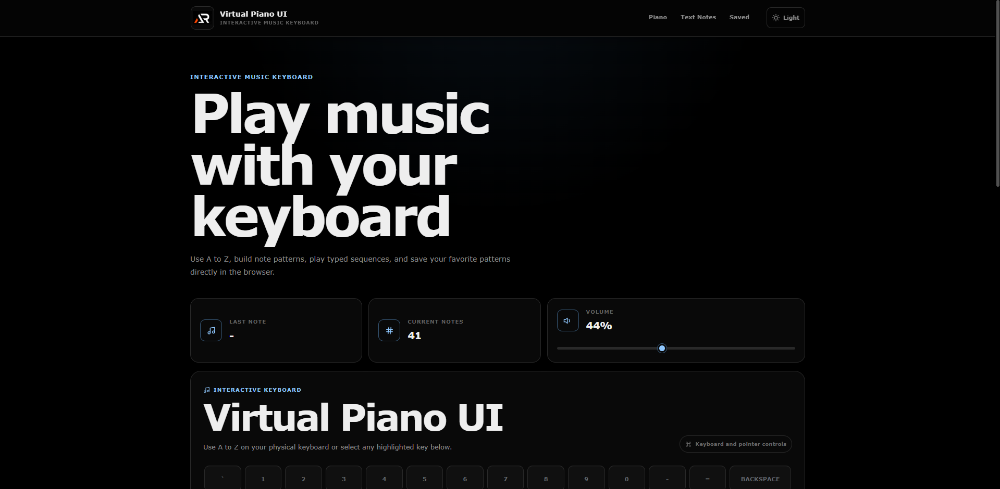

# Virtual Piano UI

A modern interactive virtual piano built with React and Vite.

Virtual Piano UI lets you play notes using your computer keyboard or on-screen controls, create note patterns, convert text into playable sequences, save patterns locally, and replay them with dedicated playback controls.

## Preview



## Live Demo

[Open Virtual Piano UI](https://a2rp.github.io/virtual-piano-ui/)

## Features

- Play notes using A to Z keyboard keys
- Interactive on-screen keyboard
- 24 local piano audio samples
- Adjustable volume control
- Current note pattern tracking
- Save note patterns in the browser
- Duplicate pattern prevention
- Play, pause, resume, and restart saved patterns
- Mute and unmute pattern playback
- Delete saved patterns with confirmation
- Convert typed text into playable notes
- Load text notes into the current pattern
- Dark and light themes
- LocalStorage persistence
- Toast notifications
- Accessible keyboard and pointer controls
- Responsive layout for desktop, tablet, and mobile
- Fixed responsive header
- Back-to-top control
- GitHub Pages deployment

## Tech Stack

- React
- Vite
- JavaScript
- SCSS Modules
- React Icons
- React Toastify
- HTML5 Audio
- LocalStorage
- ESLint
- GitHub Pages

## Project Structure

```text
src
├── components
│   ├── backToTop
│   ├── confirmModal
│   ├── controls
│   ├── currentNotes
│   ├── footer
│   ├── header
│   ├── keyboard
│   ├── pianoKey
│   ├── savedNotes
│   ├── textToNotes
│   ├── themeToggle
│   └── toast
├── constants
│   └── pianoConstants.js
├── hooks
│   ├── useLocalStorage.js
│   ├── usePianoAudio.js
│   ├── usePlayback.js
│   └── useTheme.js
├── mp3
│   └── piano audio files
├── utils
│   ├── noteUtils.js
│   └── storageUtils.js
├── App.jsx
├── App.module.scss
├── index.css
├── main.jsx
└── theme.css
```

## Getting Started

Clone the repository:

```bash
git clone https://github.com/a2rp/virtual-piano-ui.git
```

Open the project:

```bash
cd virtual-piano-ui
```

Install dependencies:

```bash
npm install
```

Start the development server:

```bash
npm run dev
```

## Available Scripts

Run the development server:

```bash
npm run dev
```

Run ESLint:

```bash
npm run lint
```

Create a production build:

```bash
npm run build
```

Preview the production build locally:

```bash
npm run preview
```

Deploy to GitHub Pages:

```bash
npm run deploy
```

## Data Storage

Saved note patterns, theme preferences, and volume settings are stored locally in the browser using LocalStorage.

No account or external database is required.

## Audio

The project uses local MP3 audio samples for piano notes.

A to X use individual audio samples. Y and Z reuse existing samples so the complete A to Z computer keyboard remains playable with the available audio set.

## Future Prospects

- Additional piano sound sets
- Multiple octaves
- Adjustable playback speed
- Pattern import and export
- Downloadable note patterns
- Improved mobile keyboard controls
- Additional instrument modes

## License

This project is licensed under the MIT License.

See the [LICENSE](LICENSE) file for details.

## Links

- [Portfolio](https://www.ashishranjan.net)
- [GitHub](https://github.com/a2rp)
- [CodePen](https://codepen.io/ash1198)
- [LinkedIn](https://www.linkedin.com/in/aashishranjan)
- [Facebook](https://www.facebook.com/theash.ashish)
- [YouTube](https://www.youtube.com/channel/UCLHIBQeFQIxmRveVAjLvlbQ)
- [Email](mailto:ash.ranjan09@gmail.com)

## Support

- [Support](https://a2rp-donation-page.netlify.app/)
- [Buy Me a Coffee](https://buymeacoffee.com/a2rp)
- [Patreon](https://www.patreon.com/a2rp)
